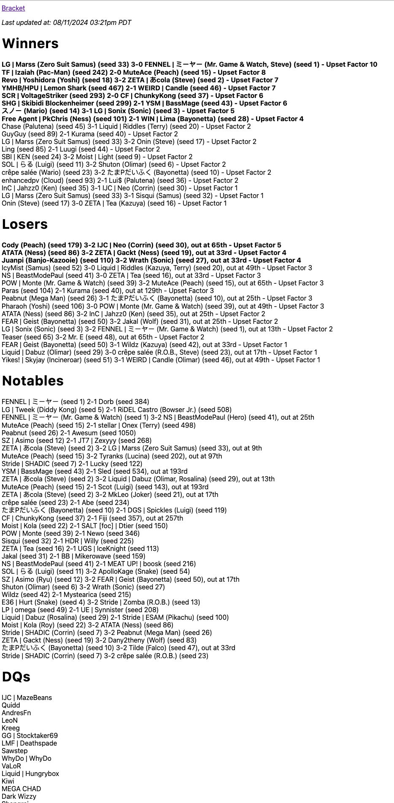

# Go GG

- Track upset threads in fighting games using StartGG API
- Goroutine to poll StartGG for newest results
- Connects to websocket so that client gets latest updates

## What's an upset or upset thread?

In fighting games, an upset is when one player who's expected to lose beats someone who's expected to win

Example:

- Player A is projected for 100th place
- Player B is projected for 1st place

If Player A beats Player B, then that's a huge upset because Player B was projected to win the entire tournament.

The lower the projected placement (seed) in which a player beats another with a higher seed, the larger the upset factor.

You can essentially create thread that looks like this



### Calculating upset factor

Every player is given a seed number in which they're projected to place in a tournament e.g. seed 1 for 1st place, seed 2 for 2nd place, etc.


If you have the winner's and loser's seed numbers then finding the upset factor is as simple as looking it up with this table

### Sections

- Winners - upsets that happened in the winners bracket
- Losers - upsets that happened in the losers bracket
- Notables - upsets that almost happened (went down to the final game in best of 3 or 5)
- DQs - players that disqualify (usually player failing to attend)

#### Interesting facts

- We care less about upset factors that are close to 0 because this means that a player beat another player where they were close in seeding. In another words, we don't really care if 1st seed player beats 2nd seed player or 100th seed player beats 101st seed player.
- We care more about upset factors the further below 0 (red section in table). This means a player that's seeded much lower outperformed a player that's seeded higher. The largest upset factor is 19 which essentially means the player that was expected to win the whole tournament loses to a player that's expected to place last in the tournament
- The upset factors further above 0 (green section in table) means the upset that could have potentially happened. This is important for determining the notable matches because it means that the player expected to win ended up winning and it came down to the final game.

## Running the app

Fill out env variables from `dotenv.dist`

```
START_GG_API_URL="https://api.start.gg/gql/alpha"
START_GG_API_KEY=
REDIS_URL=localhost:6379
```

You can obtain an api key by signing up at StartGG's developer portal

Start redis

```
redis-server
```

Start app

```
go run main.go --slug tournament/supernova-2024/event/ultimate-1v1-singles --title "Supernova Ultimate Singles Upset Thread"
```

### Testing

```
go test ./...
```

with coverage

```
go test -coverprofile=coverage.out ./...
go tool cover -html=coverage.out
```
